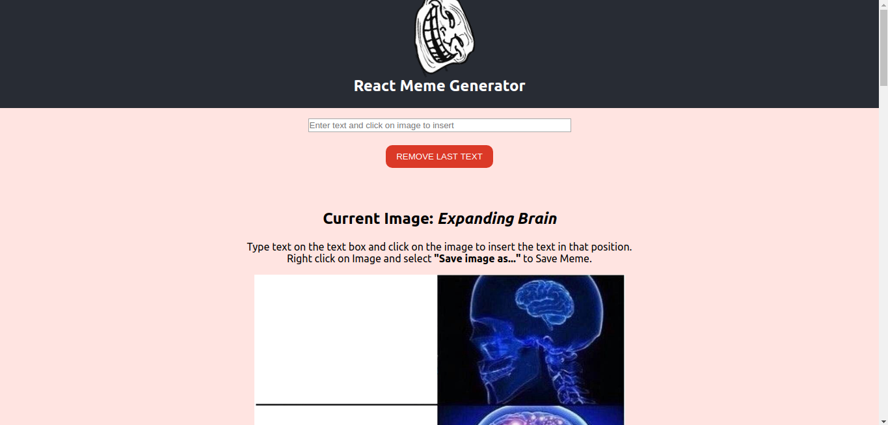
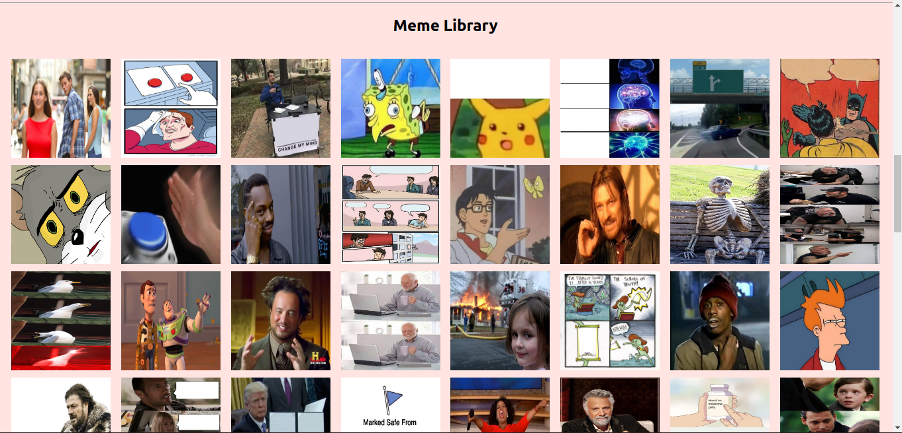
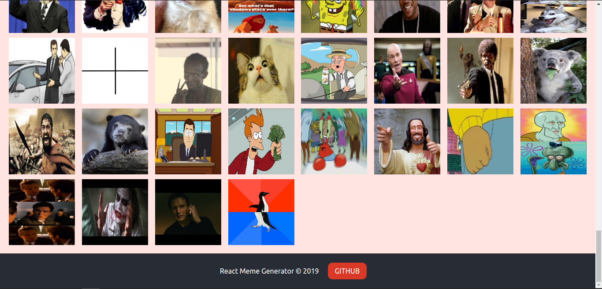

# React Meme Generator

A simple react application to make your own memes.

"_Don't Let your Memes be Dreams._"

## Resources

Images Collected from the [ImgFlip API](https://api.imgflip.com).

Inspired by [Bob Ziroll](https://twitter.com/bobziroll).

This project was bootstrapped with [Create React App](https://github.com/facebook/create-react-app).

## Sample Images

## To implement later

- allow option between black | white text
- allow user to select font size
- share on socials
